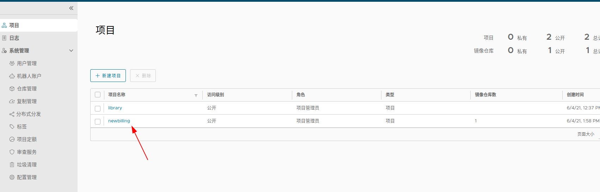

---
categories:
- k8s
  tags:
- k8s
---


# harbor

VMware开源的企业级Registry项目Harbor，以Docker公司开源的registry 为基础，提供了管理UI, 基于角色的访问控制(Role Based Access Control)，AD/LDAP集成、以及审计日志(Audit logging) 等企业用户需求的功能，同时还原生支持中文，主要特点：

基于角色的访问控制 - 用户与 Docker 镜像仓库通过“项目”进行组织管理，一个用户可以对多个镜像仓库在同一命名空间（project）里有不同的权限。

镜像复制 - 镜像可以在多个 Registry 实例中复制（同步）。尤其适合于负载均衡，高可用，混合云和多云的场景。

图形化用户界面 - 用户可以通过浏览器来浏览，检索当前 Docker 镜像仓库，管理项目和命名空间。

AD/LDAP 支持 - Harbor 可以集成企业内部已有的 AD/LDAP，用于鉴权认证管理。

审计管理 - 所有针对镜像仓库的操作都可以被记录追溯，用于审计管理。

国际化 - 已拥有英文、中文、德文、日文和俄文的本地化版本。更多的语言将会添加进来。

RESTful API - RESTful API 提供给管理员对于 Harbor 更多的操控, 使得与其它管理软件集成变得更容易。

部署简单 - 提供在线和离线两种安装工具， 也可以安装到 vSphere 平台(OVA 方式)虚拟设备
<!--more-->

# harbor架构
默认情况下，Harbor运行起来后有如下容器：  


名称分别为：nginx、harbor-jobservice、harbor-ui、harbor-db、harbor-adminserver、registry以及harbor-log。


如上图所描述，Harbor由6个大的模块所组成：  
* Proxy: Harbor的registry、UI、token services等组件，都处在一个反向代理后边。该代理将来自浏览器、docker clients的请求转发到后端服务上。
* Registry: 负责存储Docker镜像，以及处理Docker push/pull请求。因为Harbor强制要求对镜像的访问做权限控制， 在每一次push/pull请求时，Registry会强制要求客户端从token service那里获得一个有效的token。
* Core services: Harbor的核心功能，主要包括如下3个服务:
  1）UI: 作为Registry Webhook, 以图像用户界面的方式辅助用户管理镜像。 
  2) WebHook：WebHook是在registry中配置的一种机制， 当registry中镜像发生改变时，就可以通知到Harbor的webhook endpoint。Harbor使用webhook来更新日志、初始化同步job等。  
  3) Token 服务：负责根据用户权限给每个docker push/pull命令签发token. Docker 客户端向Regiøstry服务发起的请求,如果不包含token，会被重定向到这里，获得token后再重新向Registry进行请求。
* Database：为core services提供数据库服务，负责储存用户权限、审计日志、Docker image分组信息等数据。
* Job services: 主要用于镜像复制，本地镜像可以被同步到远程Harbor实例上。
* Log collector: 负责收集其他组件的日志到一个地方 
  
这里我们与上面运行的7个容器对比，对harbor-adminserver感觉有些疑虑。其实这里harbor-adminserver主要是作为一个后端的配置数据管理，并没有太多的其他功能。harbor-ui所要操作的所有数据都通过harbor-adminserver这样一个数据配置管理中心来完成。  

# Harbor实现

Harbor的每一个组件都被包装成一个docker容器。自然，Harbor是通过docker compose来部署的。在Harbor源代码的make目录下的docker-compose模板会被用于部署Harbor。打开该模板文件，可以看到Harbor由7个容器组件所组成：  
* proxy: 通过nginx服务器来做反向代理
* registry: docker官方发布的一个仓库镜像组件
* ui: 整个架构的核心服务。该容器是Harbor工程的主要部分
* adminserver: 作为Harbor工程的配置数据管理器使用
* mysql: 通过官方Mysql镜像创建的数据库容器
* job services: 通过状态机的形式将镜像复制到远程Harbor实例。镜像删除同样也可以被同步到远程Harbor实例中。
* log: 运行rsyslogd的容器，主要用于收集其他容器的日志

这些容器之间都通过Docker内的DNS服务发现来连接通信。通过这种方式，每一个容器都可以通过相应的容器来进行访问。对于终端用户来说，只有反向代理(Nginx)服务的端口需要对外暴露。
  
# harbor部署
依赖docker  docker-compose


## 安装包
https://github.com/goharbor/harbor/releases 

## 解压harbor离线版安装包
```
tar xf harbor-offline-installer-v2.2.2.tgz 

mv harbor ~/harbor
cd ~/harbor
```

## 修改harbor安装的配置文件
```
cp harbor.yml.tmpl  harbor.yml
# 挂载地址
mkdir data 
# 域名
echo 172.16.4.171 repo.goeoeo.com >> /etc/hosts

harbor.yml配置文件主要修改参数如下：
hostname: repo.goeoeo.com          //需要写IP地址或者域名
#http配置
http:
# port for http, default is 80. If https enabled, this port will redirect to https port
port: 80                       

#https配置（如不需要可不配置,本地开发我全部注释了）

# https related config
#https:
# https port for harbor, default is 443
# port: 443
# The path of cert and key files for nginx
# certificate: /your/certificate/path
# private_key: /your/private/key/path

harbor_admin_password: Harbor12345         //admin密码

 

#数据库配置
database:
# The password for the root user of Harbor DB. Change this before any production use.
password: root123
# The maximum number of connections in the idle connection pool. If it <=0, no idle connections are retained.
max_idle_conns: 50
# The maximum number of open connections to the database. If it <= 0, then there is no limit on the number of open connections.
# Note: the default number of connections is 100 for postgres.
max_open_conns: 100


#持久化数据目录
data_volume: /home/yu/harbor/data

```

## 安装并启动Harbor
```
./install.sh
```

## 访问harbor WEB界面
http://repo.goeoeo.com     admin    Harbor12345

# Harbor的使用（上传下载镜像）

## 登录harbor

防止登录失败，我没开https,修改/etc/docker/daemon.json 
```
sudo echo /etc/docker/daemon.json<<DATA
{
  "registry-mirrors": ["https://9lrfffi7.mirror.aliyuncs.com"],
  "insecure-registries":["repo.goeoeo.com","10.245.20.7:1888"]
}
DATA

sudo systemctl restart docker.service

# 登录
docker login -u admin -p Harbor12345 repo.goeoeo.com
docker login -u admin -p Harbor12345 10.245.20.7:1888
docker login -u admin -p Harbor12345 dockerhub.qingcloud.com:1880

```
## 在Harbor上创建新项目供上传使用
我创建了新项目 newbilling


## 构建镜像推送
镜像名称需要注意 为 repo.goeoeo.com/newbilling/<镜像名> 的这种格式
```
# 构建
docker build -t repo.goeoeo.com/newbilling/api-gateway:v1 .

# 推送
docker push repo.goeoeo.com/newbilling/api-gateway:v1
```
## 下载镜像
```
docker rmi repo.goeoeo.com/newbilling/api-gateway:v1

docker pull repo.goeoeo.com/newbilling/api-gateway:v1
```

## Harbor如何停止与启动
```
cd /home/yu/harbor
docker-compose down    //停止Harbor
docker-compose up -d   //启动Harbor
```

